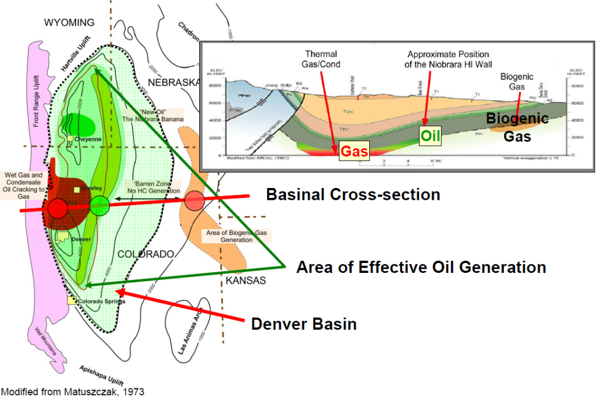
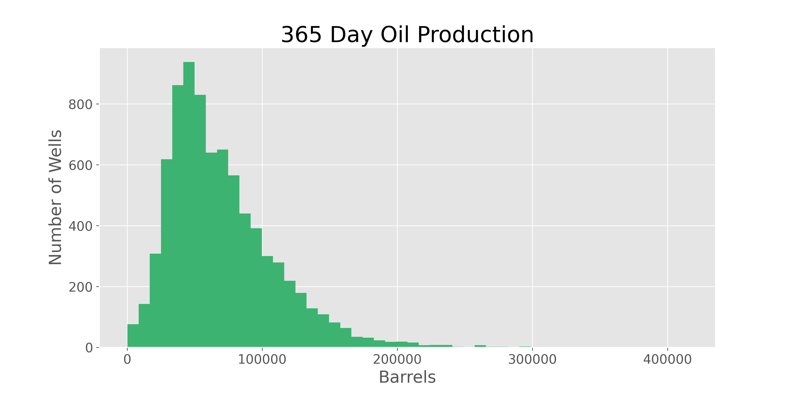
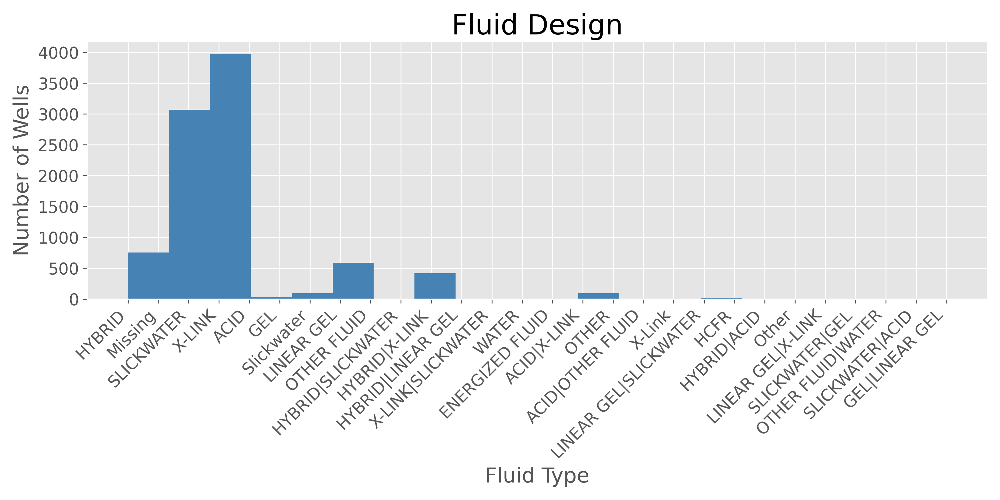
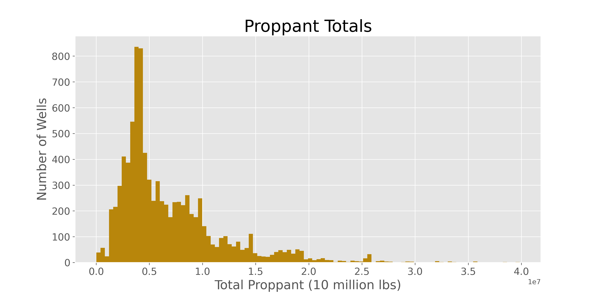
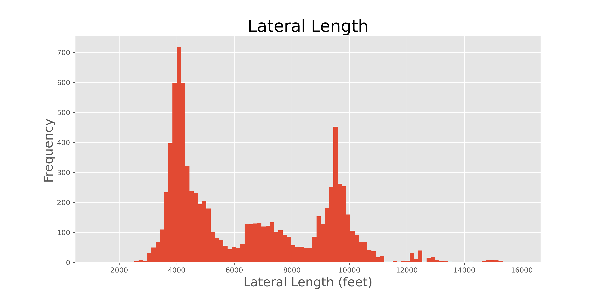
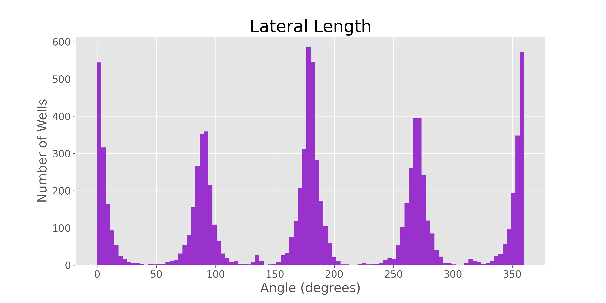
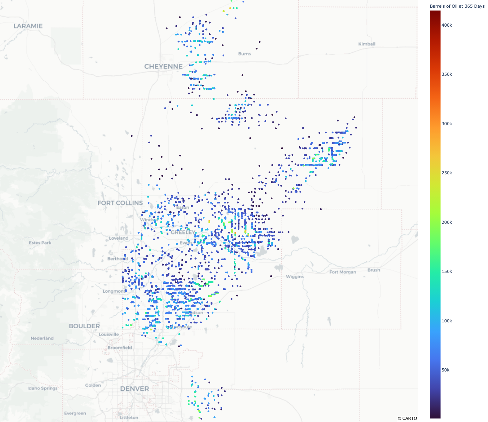
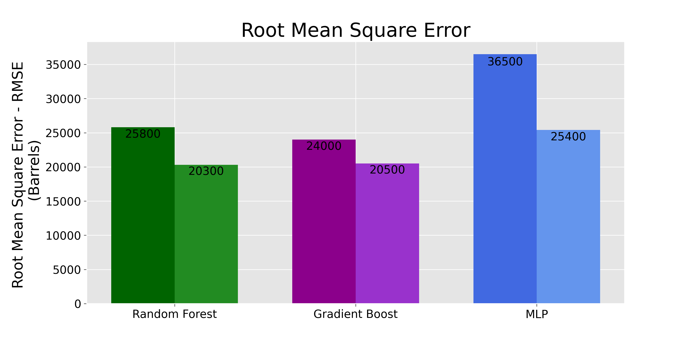
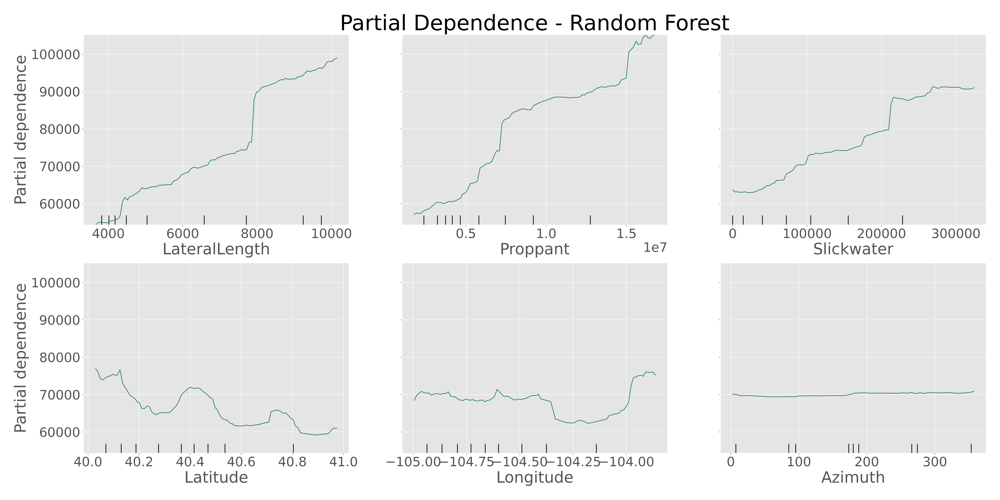
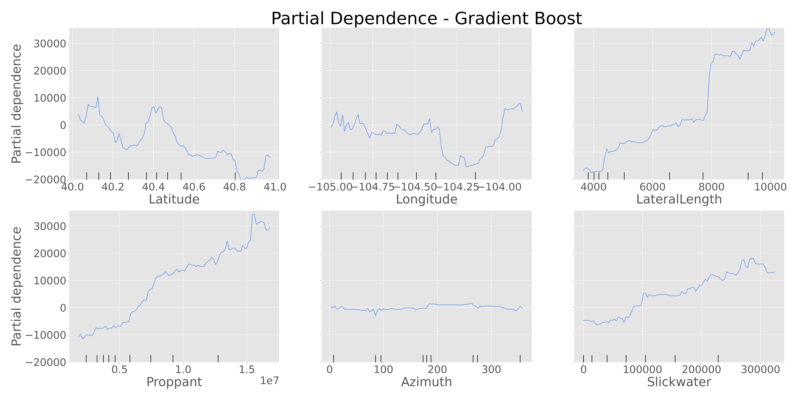

# Oil Production Forecasting

## Background and Motivation

Every operator in the Oil and Gas industry invests millions of dollars to create oil wells in unconventional oil formations (shale). Some operators do not emphasize in data collection, data analysis or data mining public data, due to the financial investment in oil wells being able to predict production would help many operators budget or decide to pursue projects or find new areas to expand. From my experience working in the industry, I believe they're multiple parameters that would influence oil production, the goal of the project is to predict the production of oil wells at 365 days (State mandatory report).

## Data & EDA

Was able to obtain a redacted data of unconventional oil wells in the Denver-Julesburg Basin. The data had over 200 columns and over 9,000 rows, but only a few columns would influence the production of oil. Explored the 365 day production, fluid type, lateral length, azimuth, and proppant for the dataset.
    

Most wells in the dataset would produce ~50,000 barrels in the 365 day time frame.
    

The fluid types in the dataset without any adjustments or changes, was quite disorganized. This seems to be a good feature to apply feature engineering. The fluids types was in 5 columns along with an additional 5 columns of volumes. Through previous analysis, fluid types influence production and fluid types is a big factor in fracture geometry which lead to production. Was able to feature engineer out 3 fluid types: Slickwater, Gel, and Hybrid.
    

A majority of wells in the DJ Basin use about 5 million pounds of proppant for the hydraulic fracture design.
    

Most lateral lengths are around 4,000 feet; however, 7,000 feet and 9,000 feet seems to be trending.
    

Most of the wells in the dataset are using 0 and 180 degrees but some are at 90 and 270 degrees. Due to geology and natural fracture of shale, the azimuth angle may influence production.
    

Due to the Denver-Julesburg Basin expanding across a few states, Wyoming wells were not removed to have more data.

  
## The Models
Explored 3 different models, Random Forest, Gradient Boost and Multi Layer Perceptron (MLP). The performance of the models out of the box had a fairly high Root Mean Square Error (RMSE). Random Forest started at a RMSE of 25,800 barrels, Gradient Boost started at 24,000 barrels and MLP started at 36,500 barrels. After some tuning on the models, Random Forest ended at 20,300, Gradient Boost ended at 20,500 and MLP ended at 25,400. 

### Hyper-Parmeters Tuned
| Spark Random Forest   |      | Spark GradientBoost   |      | Keras MLP          |               |
|-----------------------|------|-----------------------|------|--------------------|---------------|
| numTrees              | 150  | maxIter               | 150  | activation         | relu          |
| maxDepth              | 12   | maxDepth              | 5    | optimizer          | adam          |
| maxBins               | 25   | maxBins               | 95   | learning_rate      | 0.0005        |
| featureSubsetStrategy | auto | featureSubsetStrategy | auto | kernel_initializer | GlorotUniform |
|                       |      | stepSize              | 0.05 | Architecture       |               |

  

The top 2 features for the Random Forest is Lateral Length and Proppant. It also classified Slickwater which was obtain through feature engineering. 
    

The top 2 features for Gradient Boost is Latitude and Longitude. It also classified Slickwater in the 6th important feature, again a feature obtained through feature engineering.

    

The following partial dependance plots were generated using sklearn library, due to time constraints coding from scratch a partial dependance for Spark MLlib wasn’t possible. 

Both models indicates that increasing Lateral Length, Proppant, and Slickwater volume would result in a higher production. The Azimuth angle didn't indicate any change in production from 0, 90, 180, 270 degrees. The Latitude and Longitude shows the areas which oil wells would most likely produce more or less. 

   

## Conclustion
A Random Forest model will work well for areas where an operator already established. Since the top 2 features is Lateral Length and Proppant, which are well design and hydraulic fracture design parameters.

A Gradient Boost model will work well in areas where an operator isn't established or new areas to explore. Since the top 2 features is Latitude and Longitude, which are location parameters. 

Slickwater, which was a engineered feature shows up on both models as an influencing feature for oil production. This feature was not obvious in the fluid data in the original dataset.

## Future Work
Collect more data to have more wells at 365 days to help the models train. Adjust MLP parameters to lower RMSE and to create permutation importance. Apply proprietary data into the dataset to see if influences oil production. Apply the model to other basins. Flask app on AWS for users to input parameters and get an output of 365 day prediction.

   

## Credits
* https://www.niobraranews.net/

