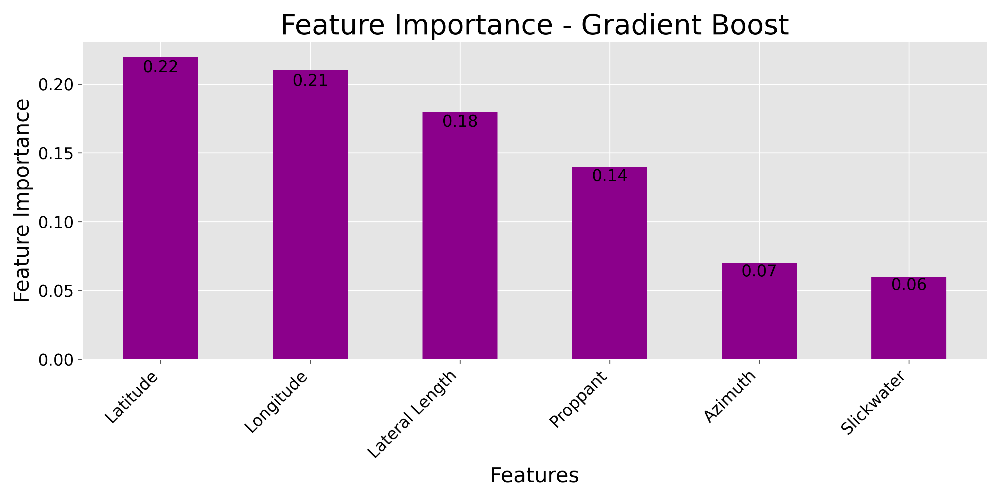
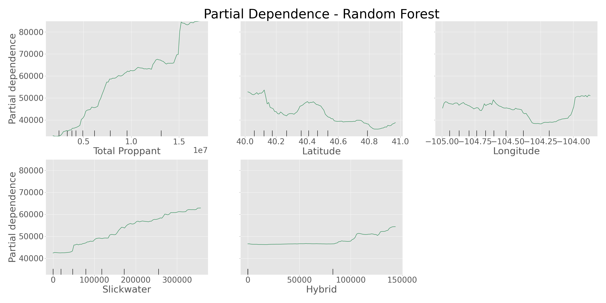
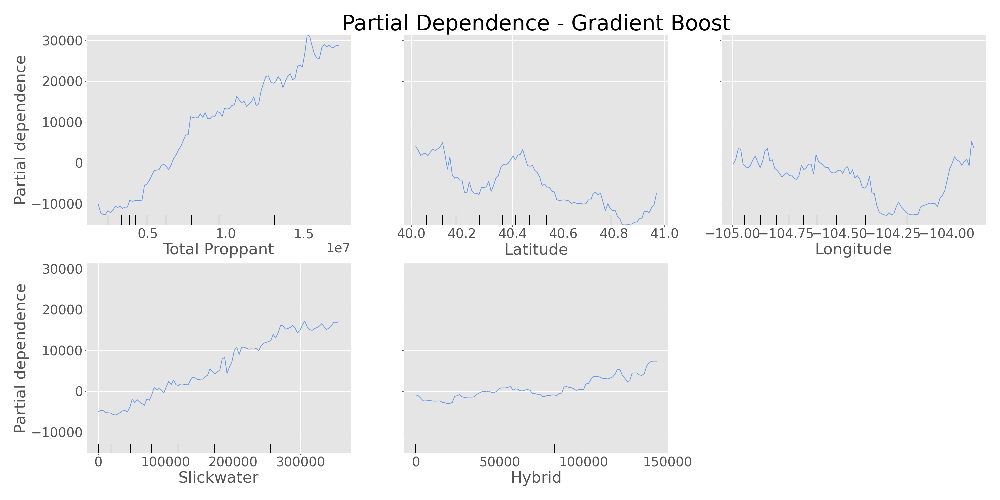

# Oil Production Forecasting

## Background and Motivation

Every operator in the Oil and Gas industry invests millions of dollars to create oil wells in unconventional oil formations (shale). Some operators do not emphasize in data collection, data analysis or data mining public data, due to the financial investment in oil wells being able to predict production would help many operators budget or decide to pursue projects or find new areas to expand. From my experience working in the industry, I believe they're multiple parameters that would influence oil production, the goal of the project is to predict the production of oil wells at 180 days (State mandatory report).

* <b>Formation</b>
    * Certain formations out produce others in the same basin
* Fluid System
    * <b>Slickwater</b>
        * Complex fractures
    * <b>Hybrid</b>
        * Mix of complex and simple fractures
    * <b>Gel</b>
        * Simple fractures
* Location - <b>Latitude & Longitude</b>
    * Most basins have a sweet spot where oil production is the best
* <b>Total Proppant</b>
    * Amount of proppant (sand) used during hydraulic fracturing

## Data & EDA

Was able to obtain a redacted data of unconventional oil wells in the Denver-Julesburg Basin. The data had over 200 columns and over 9,000 rows, but only a few columns would influence the production of oil. Organize fluid volumes into the three fluid types used for hydraulic fracturing. Ploted the median production at every mandatory reporting times and found that one formation will produce more oil in the long term.

Found 12 wells that are not in the two most targeted formations, so those 12 wells were removed from the data set. On 180-day production mark the data has 502 wells that have not been recorded as of this time.

Using the Pearson’s R correlations plot, there is no correlation for location (latitude and longitude) which is quite odd due to common sense; we know oil isn’t everywhere and oil is only at certain locations in the world.

Due to the Denver-Julesburg Basin expanding across a few states, I decided to include the wells in Wyoming to have more data.

  
## Random Forest & Gradient Boost
Used Random Forest and Gradient Boost, both methods are ensemble methods where weak learning decision trees are used to create a strong learner. First step was to determine the amount of decision trees to use before diminishing returns occur, so a plot was generated with changing number of trees used.

These plots allowed a starting point to determine other hyper-parameters to use. A RandomizedCV search was train on different options and was loop through a few times to get different combinations. The results are as follows:
  

### Hyper-Parmeters
| Random Forest |       | Gradient Boost  |       |
|---------------|-------|-----------------|-------|
| bootstrap     | False | learning_rate   | 0.024 |
| max_depth     | 41    | max_depth       | 9     |
| max_features  | 3     | max_features    | 7     |
| n_estimators  | 309   | min_sample_leaf | 11    |
|               |       | n_estimators    | 1156  |
|               |       | subsample       | 0.69  |
  

### Results of Hyper-Parmeter Tuning

|                     | Random Forest | Gradient Boost |
|---------------------|---------------|----------------|
| Model Train Score   | 0.9689        | 0.9316         |
| Model Test Score    | 0.7644        | 0.7503         |
| Model Predict Error | 12220.79      | 12582.48       |
  
The Random Forest model seems to be overfitting  on the training data, due to the high accuracy of training score and the lower test score. Gradient Boost results leans to not overfit due to the smaller difference between training score and test score. 

Now the last question is 'which features did the models find important?' To answer this question, we generated feature plots and partial dependency plots where generated. Both models picked the same top 5 features which would influence oil production.

As total proppant increases, we would expect a higher production. For fluid systems a slickwater has the best trend for higher production. Hybrid seems to be flat until a certain amount then will trend for higher production but not as much of a trend like slickwater. Latitude and longitude does not show an overall trend and it increases but it shows which locations would produce better than others.

## Future Work
Due to the prediction being off 12,000 barrels or off about $550,000, possibly look into a neural network for prediction.

Still have a lot of data that is not in the public domain which may influence production. Due to the proppant breakdown in the dataset not recorded in a standard; a possible manual clean up on the proppant to determine which type influences production (sizes, white, local, ceramic, resin coated, self-suspending proppant …)

